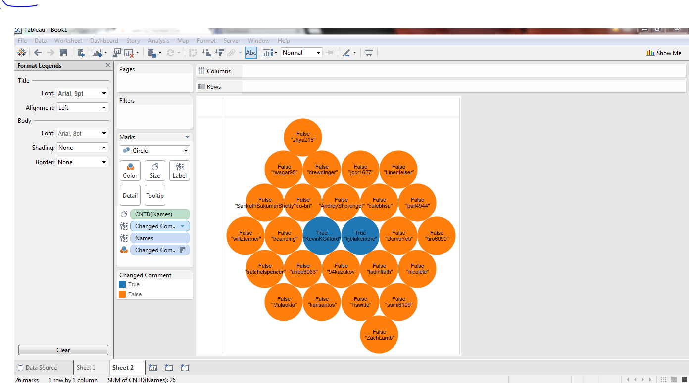
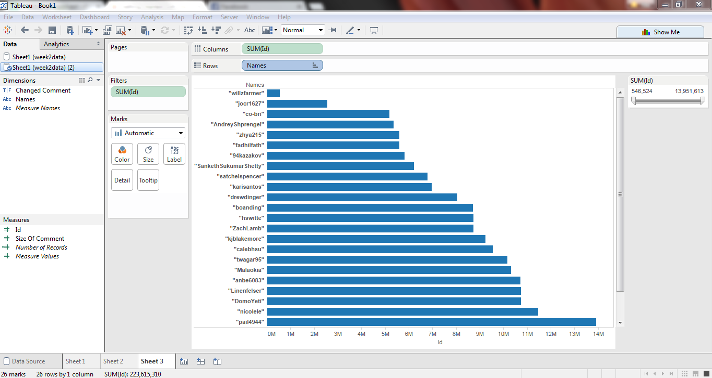
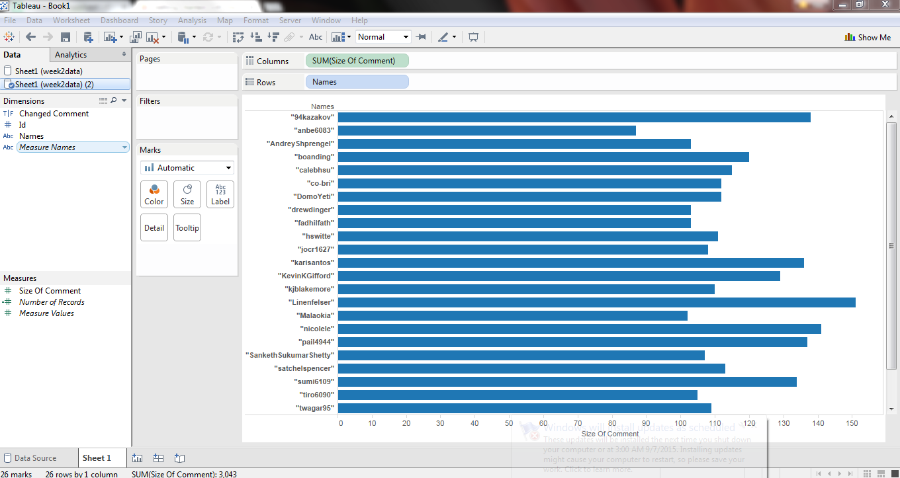

# Tableau Visualization

Tableau is arguably the biggest deal now in terms of data visualization for non-programmers.
Let's pretend you are not a programer. Learn and experience what it is like to make
visualizations using Tableau to answer the same questions about your classmates in our course.

For each of the question, think about what chart you should use to convey your answer and
make your best effort to create something that makes sense to you. There's no right
or wrong. When we meet in the class again, we will set aside time for each team to discuss
and compare the variety of visualization solutions each member has come up with for the
same set of questions. It will be fun!

To include a Tableau visualization in your report, take a screenshot, save it as an image,
put it in the `learning/week2` folder, and replace ``  with
your own image. Please makes sure your screenshot includes the _entire_ Tableau interface
including the controls, widgets ...etc.

# How big the deal Tableau really is?

(given the growth of the company and thier revenue, it is clear that they have been very succefull in the last few years. 
For example thier revenue grew 82% from 2012 ro 2013)

# Who changed thier comment?

(THose whose circle is marked blue and labeled true changed thir comment)

# Who has the oldest account

(Assuming that github ids are assigned in order those who have the smapllest id have the oldest account.
The chart shows the ids ordered ascending)

#Who wrote the most for thier comment

(The length of the comment(charachters) is represented by the horizantal bars)

